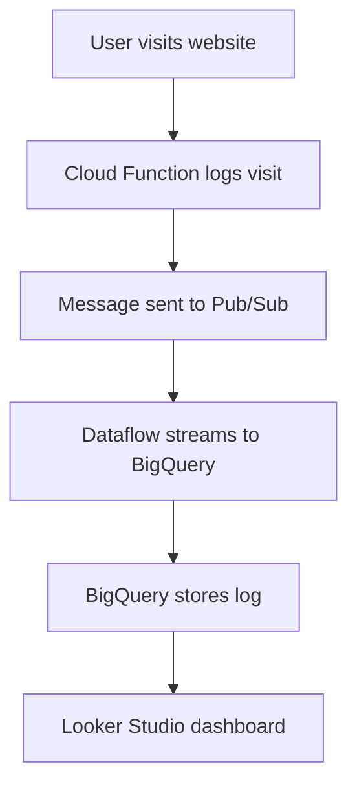

# 📊 Real-Time Visitor Tracker using Google Cloud Platform (GCP)

Track visitors to your portfolio site **in real time** using **Cloud Functions**, **Pub/Sub**, **Dataflow**, **BigQuery**, and **Looker Studio**.

---

## 🚀 Live Demo

- 🌐 **Portfolio Website**: [Visit Here](https://storage.googleapis.com/my-portfolio-bucket-123/index.html)
- 📈 **Live Visitor Dashboard**: [View Analytics](https://lookerstudio.google.com/reporting/46d8e6ae-f799-4bcc-87f8-6c4228ef8ae5)

---

## 🔧 Technologies Used & Their Roles

| GCP Service        | What It Does |
|--------------------|--------------|
| **Cloud Storage**  | Hosts your static website (HTML) |
| **Cloud Functions**| Triggered when someone visits, logs a message |
| **Pub/Sub**        | Passes messages (like "visitor came") from one service to another |
| **Dataflow**       | Streams data from Pub/Sub into BigQuery |
| **BigQuery**       | Stores all visitor logs (timestamp, browser info) |
| **Looker Studio**  | Reads from BigQuery to show real-time graphs and charts |

---

## 🧠 How Everything Connects



---

## 📁 Project Files

```bash
real-time-visitor-tracker/
├── index.html         # Static website with embedded dashboard
├── main.py            # Cloud Function to log visit
├── requirements.txt   # Python dependencies
└── README.md          # This file
```

---

## 🛠️ Step-by-Step Guide to Deploy

### ✅ 1. Create a GCS Bucket

```bash
gsutil mb gs://my-portfolio-bucket-123
gsutil cp index.html gs://my-portfolio-bucket-123
```

Make the file public:
- In Cloud Console → Bucket → index.html → Permissions → Add `allUsers` as `Reader`

---

### ✅ 2. Create a Pub/Sub Topic

```bash
gcloud pubsub topics create visitor-events
```

---

### ✅ 3. Deploy the Cloud Function

```bash
gcloud functions deploy log_visit \
  --runtime python311 \
  --trigger-http \
  --entry-point log_visit \
  --allow-unauthenticated \
  --region=us-central1
```

---

### ✅ 4. Create BigQuery Dataset/Table

- Dataset: `portfolio_logs`
- Table: `visits`
  - Fields: `message` (STRING), `timestamp` (STRING), `user_agent` (STRING)

---

### ✅ 5. Stream Data Using Dataflow Template

```bash
gcloud dataflow jobs run portfolio-log-job-$(date +%Y%m%d%H%M%S) \
  --gcs-location=gs://dataflow-templates-us-central1/latest/PubSub_to_BigQuery \
  --region=us-central1 \
  --staging-location=gs://my-portfolio-bucket-123/tmp/ \
  --parameters inputTopic=projects/YOUR_PROJECT_ID/topics/visitor-events,outputTableSpec=YOUR_PROJECT_ID:portfolio_logs.visits
```

---

### ✅ 6. Build Dashboard in Looker Studio

- Connect Looker Studio to BigQuery
- Create:
  - 📊 Scorecard: Total Visitors
  - 📈 Time Series: Visits Over Time
  - 🧩 Pie Chart: User Agents
- Enable `Anyone with the link` can view
- Get embed link like this:

```html
<iframe width="100%" height="600"
  src="https://lookerstudio.google.com/embed/reporting/46d8e6ae-f799-4bcc-87f8-6c4228ef8ae5/page/1M"
  frameborder="0" style="border:0" allowfullscreen></iframe>
```

Paste into `index.html` — already done for you.

---


